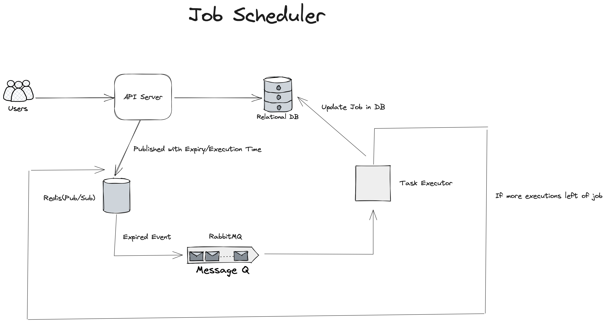

## Introduction

This project offers a way to schedule tasks present on the server. This project has been made using NodeJS, Redis, RabbitMQ, MySQL.


## High Level Design



## Getting Started

After Cloning the repository we need to set up MySQL, Redis and RabbitMQ.

Create a database in your system and navigate to db folder where there will be db.js. Enter your database name, your credentials.

Install docker on your system and run the following commands to run Redis and RabbitMQ

```bash
docker run --name my-redis -p 6379:6379 -d redis
```


## API Specification

# Registration
